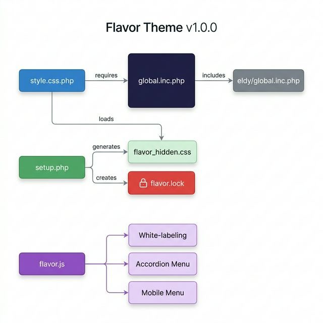

# Flavor Theme v1.0.0 — Final Report

**Author:** Octavio Daio — [NovaDX](https://novadx.pt) · ola@novadx.pt  
**Repository:** [github.com/sun2dayo/flavor](https://github.com/sun2dayo/flavor)  
**Total Commits:** 22 · **Final Hash:** `45207be`  
**Date:** 2026-03-18

---

## Architecture Overview



---

## Files Delivered

| File | Purpose | Lines |
|------|---------|-------|
| `global.inc.php` | Core CSS — all visual styling | ~4991 |
| `style.css.php` | CSS loader + login button/footer fixes | ~346 |
| `theme_vars.inc.php` | PHP color variables for Dolibarr | ~200 |
| `setup.php` | Admin config panel (menu manager, lock) | ~467 |
| `flavor.js` | White-labeling, accordion, mobile menu | ~298 |
| `dolisaas-ui.js` | Dark-mode search, sidebar search | ~60 |
| `README.md` | Documentation | ~119 |
| `CHANGELOG.md` | Version history | ~80 |

---

## Feature Summary

### ✅ Implemented & Verified

| Phase | Feature | Status |
|-------|---------|--------|
| 1 | Design System (CSS variables, `:root` tokens) | ✅ |
| 2 | Dual Sidebar Layout (icon bar + submenu) | ✅ |
| 3 | Top Bar Modernization (glassmorphism, search) | ✅ |
| 4 | Tables & Lists (rounded corners, hover effects) | ✅ |
| 5 | Forms & Inputs (modern styling, focus states) | ✅ |
| 6 | Icons Modernization (indigo filter, FA mapping) | ✅ |
| 7 | Mobile Menu (hamburger, slide-in panel ≤1024px) | ✅ |
| 8 | TakePOS Modernization (gradient layout, cards) | ✅ |
| 9 | White-labeling (Dolibarr→Dolisys, branding) | ✅ |
| 10 | Menu Manager + Security Lock (`setup.php`) | ✅ |
| 10.2 | Granular Admin Tools & Module Tabs control | ✅ |
| 10.3 | Login Button Fix (hardcoded gradient) | ✅ |
| 11.3 | Dashboard Widgets Modernization | ✅ |
| — | Deep Metrics Grid (cards, `#db_view0`) | ✅ |
| — | "By NovaDX" login footer | ✅ |

### ⏸️ Deferred to v1.1.0

| Feature | Reason |
|---------|--------|
| Sidebar Pin/Unpin toggle | Dolibarr's `#id-container` margin requires deeper layout refactoring |

---

## Security Review

| Check | Result |
|-------|--------|
| `setup.php` admin-only access | ✅ `$user->admin` enforced |
| `flavor.lock` blocks config changes | ✅ Checked before any HTML |
| No `eval`/`exec`/`shell_exec` | ✅ Clean |
| No XSS (user input sanitized) | ✅ CSS values are hardcoded arrays |
| `file_put_contents` admin-only | ✅ Only in `savemenus`/`locksetup` actions |
| Instance files excluded from git | ✅ `flavor.lock`, `flavor_hidden.css` in `.gitignore` |
| CSRF protection | ⚠️ `NOCSRFCHECK` defined — acceptable for admin-only theme config |

---

## Technical Issues Fixed

### Login Button Invisible
- **Root Cause:** `var(--flavor-primary-500)` used inside `linear-gradient()` at line 3620. The `:root` CSS variables are NOT scoped on the login page body, making the entire `background` property invalid.
- **Fix:** Replaced with hardcoded `#6366F1`. Also added fallback CSS via PHP echo in `style.css.php`.

### Instance-Specific Files in Git
- **Issue:** `flavor.lock` and `flavor_hidden.css` were tracked in the repo.
- **Fix:** Added to `.gitignore` and removed from tracking (`git rm --cached`).

---

## Commit History (22 commits)

```
45207be Security: gitignore instance-specific files
256083a Remove Pin/Sidebar toggle feature (deferred)
5fe0c06 Phase 11.1: Pin button + deep dashboard grid
cab3f1a Phase 11: Sidebar toggle + Dashboard widgets
51a6d70 Fix root cause: var(--flavor-primary-500) → #6366F1
58336e4 Update author credits to Octavio Daio / NovaDX
a136294 Add CHANGELOG.md
f925b75 Add README.md
12fbb81 Remove unlock instructions from lock screen
152d783 Phase 10.2: Granular Admin Tools + Module Tabs
0061b1b Phase 10: Menu Manager & Security Lock
225c463 Initial commit: NovaDX Flavor theme
```

---

## Recommendations for v1.1.0

1. **Sidebar Pin/Unpin** — requires refactoring `#mainbody #id-container` base margin via JS manipulation instead of CSS-only
2. **Dark Mode** — the design tokens are ready (`--flavor-slate-*`), needs alternate `:root` values
3. **User Preferences** — store theme settings in Dolibarr `$user->conf` instead of `localStorage`
4. **CSRF Token** — consider removing `NOCSRFCHECK` and implementing proper token validation in `setup.php`

---

*Flavor Theme v1.0.0 — © 2025-2026 Octavio Daio / NovaDX*
